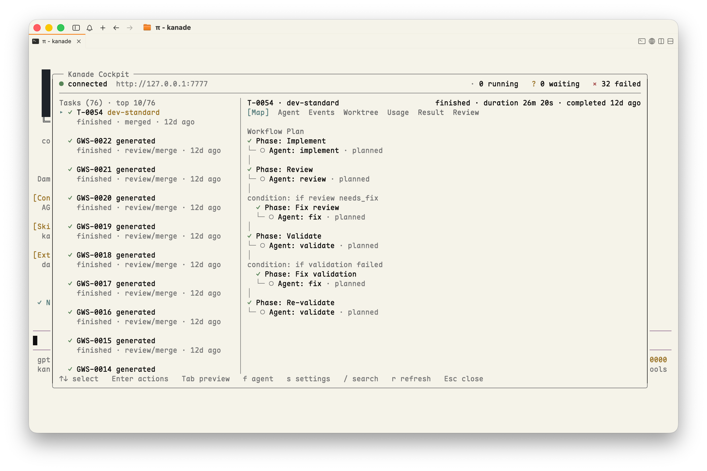

# kanade（奏）

> Multi-agent workflow runtime for coding tasks. Write workflows in JavaScript, let agents do the work, iterate until it is ready, then merge deliberately.

Kanade runs a local HTTP server plus CLI. A task is a workflow script that can call agents, run phases, ask humans for decisions, preserve worktrees for recovery, and be rerun or iterated with context from previous attempts.



## Why Kanade?

- **Scriptable multi-agent workflows** — orchestrate `analyze`, `implement`, `review`, validation, custom `agent(...)` calls, `parallel(...)`, and `request_human(...)` from JavaScript.
- **Three workflow sources** — run saved workflows, inline scripts, or ask Kanade to generate a workflow from a prompt.
- **Iterative by design** — `iterate` creates a new task with `previousResult`, `previousTaskId`, and `reuseBranch` so agents can continue from prior work.
- **Git worktree isolation** — agents can work in task branches; failed/aborted worktrees are preserved by default for inspection and recovery.
- **Human gates** — workflows can pause for approval or free-form input, then resume when answered.
- **Journal cache and reruns** — repeated agent calls can be reused when inputs and workspace state match.
- **CLI-first operation** — Kanade is fully usable from the `kanade` CLI and HTTP API; the Pi cockpit is optional.
- **Optional Pi cockpit** — the project ships a Pi extension (`/kanade`) for task monitoring, recovery, merge readiness, settings, and agent-session inspection.

## Status

Kanade is an early public-preview project. The core runtime, server, CLI, tests, and Pi extension are usable, but APIs and workflow conventions may still change.

## Requirements

- Node.js 22+
- Git
- Model/provider configuration available through Pi inheritance or configured directly in `~/.kanade/config.yml`
- Optional: Pi, if you want the `/kanade` cockpit UI

## Quick start

```bash
git clone <repo-url> kanade
cd kanade
npm install

# Optional: install the local CLI shim so `kanade` is on PATH.
npm link

# Start the local server. Data is stored in ~/.kanade by default.
kanade start --daemon
kanade health
```

Without `npm link`, run the CLI through npm:

```bash
npm run cli -- start --daemon
npm run cli -- health
```

Run a generated workflow from a prompt:

```bash
kanade run --prompt "Add retry handling to the API client and update tests" --follow
```

Run a saved workflow:

```bash
kanade workflows
kanade run <workflow-name> --args '{"target":"src/api.ts"}' --follow
```

Iterate and merge:

```bash
kanade iterate T-0001 --instructions "Keep the useful changes, add tests, and fix review feedback"
kanade show T-0002
kanade merge T-0002      # only after review
```

## Optional Pi cockpit

Kanade does not require Pi or the cockpit UI. The CLI and HTTP API are the portable baseline and are enough to run, monitor, iterate, and merge tasks.

This repository also includes a project-local Pi extension and skill:

```text
.pi/extensions/kanade/   # /kanade cockpit UI
.pi/skills/kanade/       # Kanade operating guidance for Pi
```

If you use Pi, trust the project, run `/reload`, then `/kanade`.

The cockpit shows:

- running / waiting / failed task counts;
- task list with preserved worktree hints;
- workflow map, agent events, usage, result, review, and worktree tabs;
- recovery actions for failed/aborted tasks;
- merge readiness and guarded destructive actions.

## Portable agent skill

The Kanade skill in `.pi/skills/kanade/SKILL.md` is intentionally CLI-first. You can copy its Markdown content into other coding agents as operating guidance, even when the Pi extension is not installed.

It is also composable: combine the Kanade skill with project-specific skills or coding-agent instructions. The important contract is to use the `kanade` CLI/HTTP API as the baseline, monitor tasks compactly, and require explicit confirmation before dangerous actions such as merge, reject cleanup, or abort.

## Workflow model

A workflow is a JavaScript file whose first statement exports metadata:

```js
export const meta = {
  name: "safe-change",
  description: "Implement, review, and validate a focused code change",
  phases: [
    { title: "Implement" },
    { title: "Review" },
    { title: "Validate" },
  ],
};

phase("Implement");
const implementation = await implement(args.instructions, {
  guidance: "Make a small, reviewable change and summarize touched files.",
});

phase("Review");
const review = await reviewChange("Review the implementation for correctness and tests.");

phase("Validate");
const validation = await testChange("Run the relevant checks and report failures clearly.");

return { implementation, review, validation };
```

Workflows can be stored under `~/.kanade/workflows`, generated through the API/CLI, or submitted inline.

## CLI

```bash
# Server
kanade start --dir ~/.kanade --port 7777 --daemon
kanade health

# Tasks
kanade ls [--status running|finished|failed|needs_human] [--json]
kanade show <task-id> [--json]
kanade tail <task-id>
kanade run <workflow-name> [--args '{}'] [--follow]
kanade run --prompt '...' [--workflow-size small|medium|large] [--follow]
kanade iterate <task-id> --instructions '...'
kanade rerun <task-id> [--follow]

# Human gates
kanade inbox [--json]
kanade respond <task-id> --request <request-id> --decision approve

# Lifecycle
kanade merge <task-id>
kanade reject <task-id>
kanade abort <task-id>
kanade reconcile <task-id> [--merge-commit <sha>]

# Workflows
kanade workflows [--json]
kanade save <task-id> --as <workflow-name> [--force]
```

Target a different server with `--url` or `KANADE_URL`:

```bash
kanade start --dir /tmp/kanade-dev --port 7778 --daemon
kanade --url http://127.0.0.1:7778 ls
```

## HTTP API

```text
POST /tasks                    Create task (inline/saved/generated)
POST /tasks/:id/iterate        Iterate with new instructions
POST /tasks/:id/rerun          Rerun with journal cache
POST /tasks/:id/merge          Merge worktree branch
POST /tasks/:id/reconcile      Mark manually merged work as merged
POST /tasks/:id/abort          Abort running task
POST /tasks/:id/respond        Respond to human request
POST /tasks/:id/save           Save generated/inline script as workflow

GET  /tasks                    List tasks
GET  /tasks/:id                Task details + usage + iteration chain
GET  /tasks/:id/review         Merge-readiness review
GET  /tasks/:id/snapshot       Runtime progress snapshot
GET  /tasks/:id/events         Task event stream replay
GET  /tasks/:id/journal        Agent/human journal
GET  /tasks/:id/artifacts      Debug artifacts
GET  /tasks/:id/sessions       Persisted subagent sessions
GET  /inbox                    Pending human requests
GET  /events                   Global SSE stream
GET  /health                   Health check
```

## Configuration

Kanade reads `~/.kanade/config.yml` by default. A minimal config can rely on inherited Pi settings:

```yaml
models:
  mode: inherit-pi
  inheritPiSettings: true

defaults:
  maxConcurrentTasks: 0        # 0 = unlimited
  concurrency: 16

isolation:
  defaultMode: worktree
  defaultBaseBranch: develop
  autoCleanupOnReject: false   # preserve failed/rejected work by default
  autoCleanupOnAbort: false

cleanup:
  enabled: true
  schedule: "0 * * * *"

announcers: []
```

See [docs/configuration.md](docs/configuration.md) for the full configuration reference.

Useful environment variables:

```text
KANADE_DIR    Server data directory (default: ~/.kanade)
KANADE_URL    CLI target URL (default: http://127.0.0.1:7777)
```

## Development

```bash
npm run lint
npm run typecheck
npm test
npm run smoke:pi-kanade
npm run eval              # mock eval framework
```

Project layout:

```text
src/config/           YAML config loading
src/store/            SQLite state store
src/workflow-engine/  Sandbox runtime, agent wrapper, snapshots
src/isolation/        Git worktree lifecycle
src/server/           HTTP API, task manager, event bus, cleanup
src/tracing/          OpenTelemetry spans and logs
.pi/extensions/       Pi cockpit extension
.pi/skills/           Pi skill guidance
test/e2e-mock/        End-to-end tests with mocked LLM sessions
```

## Security notes

Kanade is a local automation runtime. Workflow scripts and Pi extensions run with your local permissions, and agents can execute tools against worktrees. Only run workflows/extensions you trust, inspect generated scripts before promotion, and merge only after reviewing changes and checks.

## Notices and license

Kanade is MIT licensed. See [LICENSE](LICENSE).

Portions of `src/workflow-engine/` are derived from [`pi-dynamic-workflows`](https://github.com/Michaelliv/pi-dynamic-workflows), MIT licensed. See [NOTICE.md](NOTICE.md).
